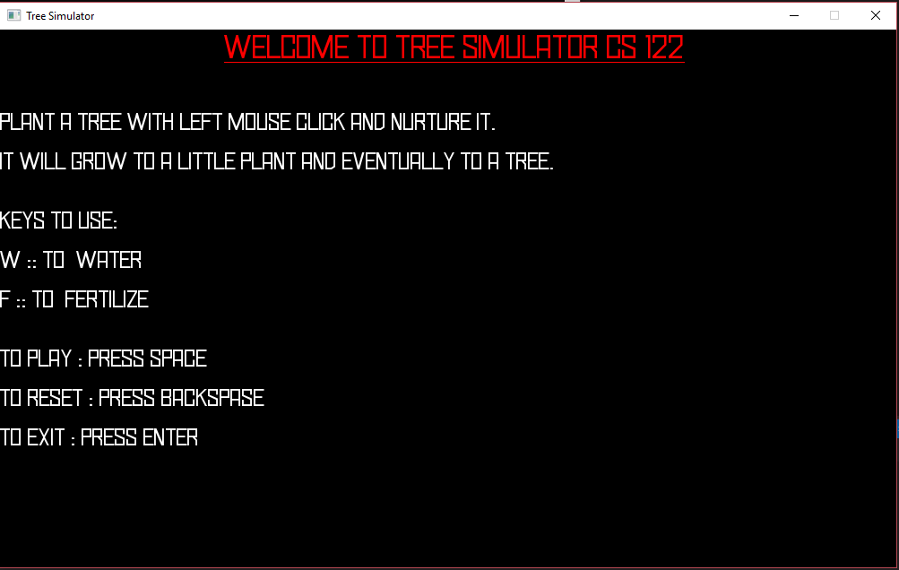
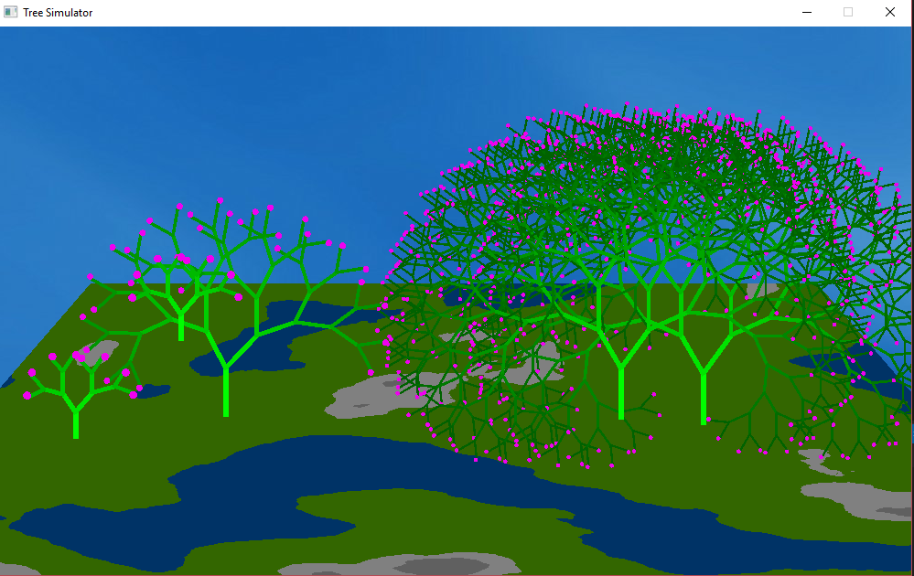
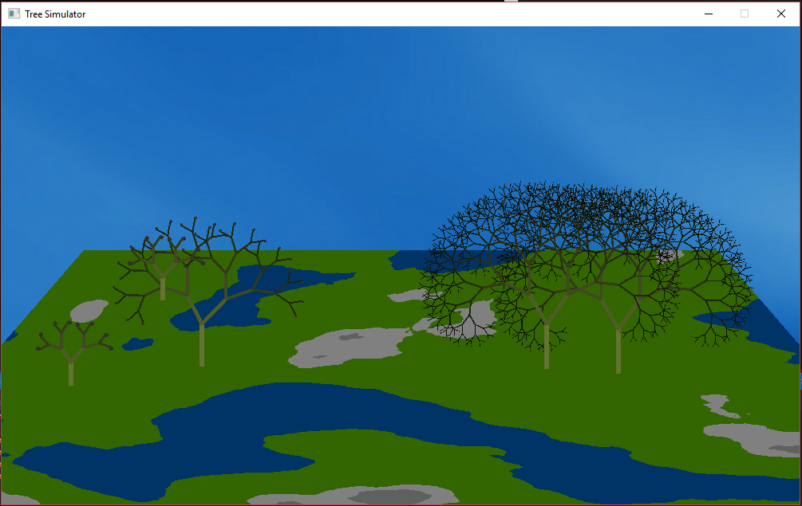

# Welcome to Tree Simulator 

This game was developed as a class project for the Cpts 122 course at Washington State University.

The team members are:
- Ramesh Kr Sah
- Benjamin Jakeman
- Michaela Bayerlova
- Mitch Boesel

Some screenshots of the game:

