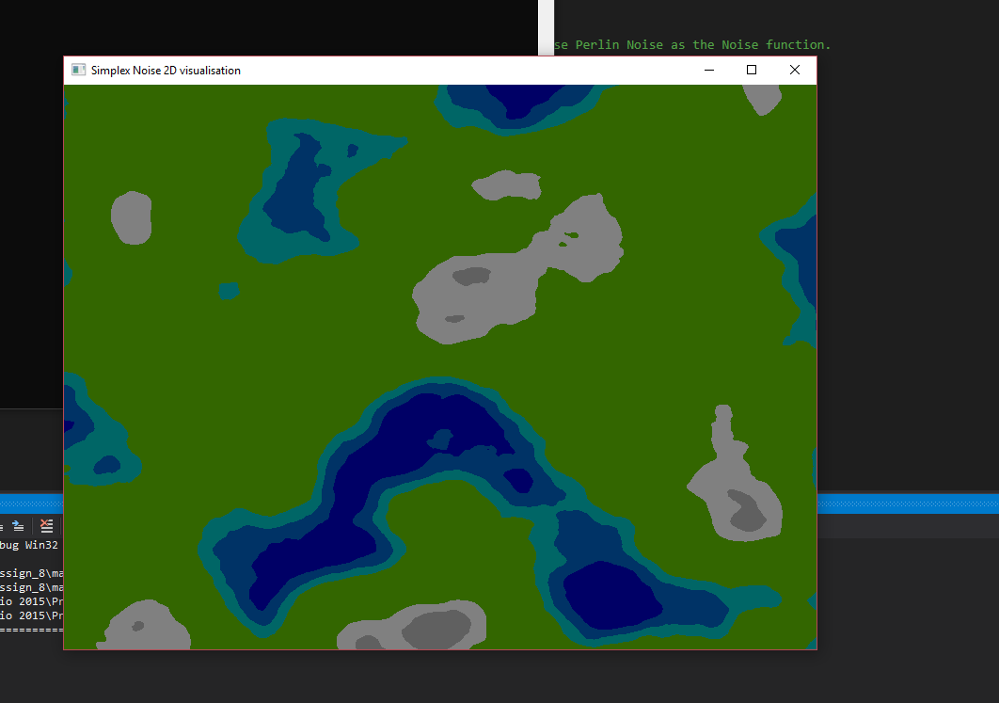

# Programming Assignment 9, CptS 122. A Tree Simulator 

1. Terrain in SFML using Simplex Noise function from here, https://github.com/PawelWorwa/SimplexNoise 
Planning to use the 2D terrain generated using the  simplex noise as the terrian for the game. The other option is to 
use Perlin Noise as the Noise function.

A demo of terrain developed using Simplex Noise. 

### Things to do:
- [x] Install SFML
- [x] [Learn GitHub](https://www.edureka.co/blog/how-to-use-github/)
- [ ] Build a basic tree, using Fractal Trees. [A Tutorial](https://www.youtube.com/watch?v=0jjeOYMjmDU&vl=en)
- [ ] Build a terrain

